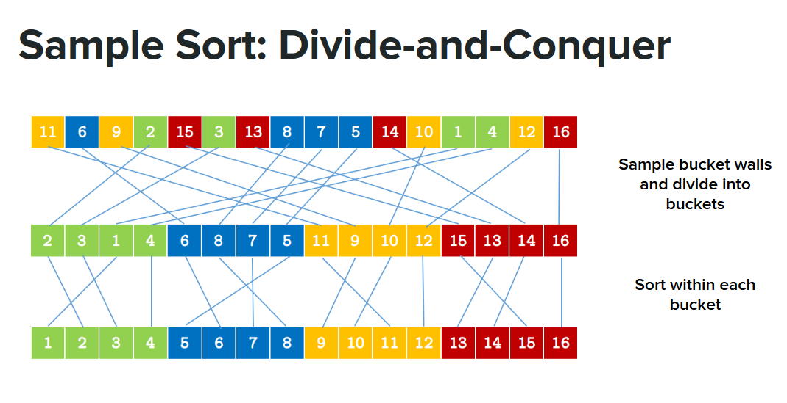

# Prerequisites
GCC

# Build
Run the "Make" command in cop5522-project/src

# SampleSort Command
./samplesort numNums randomNumBound samplesPerBucket

# DW OpenMP Command
./dw_open_mp_samplesort numOfProcessors numNums randomNumBound samplesPerBucket

numNums - The number of numbers to sort (They will be automatically generated)  
randomNumBound - The bound of the generated integers (All numbers will fall within [0, randomNumBound])  
samplesPerBucket - When initially pulling samples to approximate evenly-spaced splitters, 
                   this is how many samples are pulled per bucket (See references). Can just use value of 1

# References
http://blog.s-schoener.com/2021-05-24-parallel-sorting/  
https://en.wikipedia.org/wiki/Samplesort  

